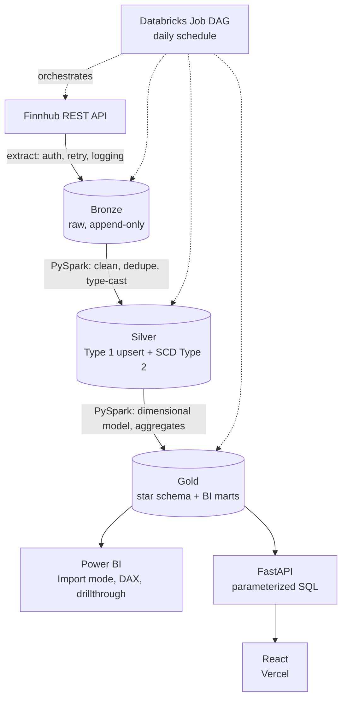

# Stock Market Lakehouse & Analytics Platform

[](https://github.com/Sakthi1030/databricks-stock-market-lakehouse/actions/workflows/ci.yml)

An end-to-end data engineering and analytics platform built on the **Medallion Architecture**, ingesting live stock market data daily from the Finnhub API, processing it through Bronze → Silver → Gold layers in Databricks (PySpark + Delta Lake + Unity Catalog), and serving it through Power BI and a live React dashboard.

Built as a production-style project — deployed, tested, and CI-gated, not a notebook that only runs on one machine.

**Live demo:** [databricks-stock-market-lakehouse.vercel.app](https://databricks-stock-market-lakehouse.vercel.app/) · API: [stock-lakehouse-api.onrender.com](https://stock-lakehouse-api.onrender.com/docs)

## Architecture



Runs on a **daily schedule** via a 4-task Databricks Job DAG (Extract → Bronze → Silver → Gold, each gated on the previous succeeding). Power BI reads Gold in Import mode (a point-in-time snapshot — refresh manually or via Power BI Service to see new data); React reads Gold live on every page load via FastAPI.

See [`docs/architecture-decisions.md`](docs/architecture-decisions.md) for the reasoning behind the medallion layers, SCD Type 1 vs Type 2, delete-then-insert vs merge, surrogate keys, and more — written to answer "why did you do it this way," not just "what did you build."

## Tech Stack

| Layer | Tool |
|---|---|
| Compute / Processing | Databricks (Free Edition, serverless), PySpark |
| Storage | Delta Lake, Unity Catalog (managed tables + Volumes) |
| Orchestration | Databricks Jobs (4-task DAG, daily schedule) |
| Language | Python 3.11, TypeScript |
| Data Source | Finnhub REST API (stock quotes, company profiles) |
| BI | Power BI (PBIP source-controlled project, DAX, custom theme) |
| Backend API | FastAPI, parameterized `databricks-sql-connector` queries |
| Frontend | React 19, TypeScript, TanStack Query/Table, Recharts, Tailwind CSS |
| Deployment | Vercel (frontend), Render (backend) |
| CI/CD | GitHub Actions — syntax check, backend tests, PySpark tests, frontend lint/test/build |
| Testing | Pytest (45 tests) + Vitest/React Testing Library (18 tests) |

## Project Structure

```
├── .github/workflows/    CI pipeline (4 jobs, runs on every push)
├── databricks/notebooks/ Databricks notebook mirrors of the ETL scripts (for the Job DAG)
├── etl/
│   ├── extract/            Finnhub API client: auth, retry, rate-limit throttling
│   ├── load/                Shared Delta I/O + Spark session helpers
│   └── utils/                Config loader, logger, data quality checks, path resolution
├── bronze/                Bronze layer: raw ingestion, schema validation
├── silver/                Silver layer: cleaning, Type 1 upsert, SCD Type 2
├── gold/                  Gold layer: star schema (dims/facts) + BI-ready marts
├── backend/               FastAPI app serving Gold via REST
├── react/                 React dashboard (Vite + TypeScript)
├── powerbi/               PBIP project (source-controlled Power BI report + semantic model)
├── config/                config.yaml — environment-agnostic pipeline settings
├── docs/                  Architecture decisions, deployment notes
└── tests/                 Backend, ETL (PySpark), and React test suites
```

## Status

- [x] Step 1 — Project foundation & environment setup
- [x] Step 2 — Extract: Finnhub API client (auth, retry, logging)
- [x] Step 3 — Bronze layer (raw ingestion to Delta)
- [x] Step 4 — Silver layer (cleaning, validation, incremental merge)
- [x] Step 5 — Gold layer (dimensional model, aggregations)
- [x] Step 6 — Automation / scheduling (Databricks Job DAG)
- [x] Step 7 — Power BI dashboard
- [x] Step 8 — FastAPI backend
- [x] Step 9 — React frontend (deployed live)
- [x] Step 10 — Testing (63 tests, CI-gated)
- [x] Step 11 — Documentation & deployment guide

## Setup

### Data pipeline (local)

```bash
python -m venv venv
venv\Scripts\activate        # Windows
pip install -r requirements.txt
cp .env.example .env         # fill in FINNHUB_API_KEY

python -m etl.extract.run_extract
python -m bronze.ingest_bronze
python -m silver.ingest_silver
python -m gold.ingest_gold
```

Requires a local JDK 17 and Hadoop `winutils.exe` on Windows (see `docs/architecture-decisions.md` for why). On Databricks, the same code runs unmodified — `etl.utils.paths` detects the environment and switches from local paths to Unity Catalog automatically.

### Backend API (local)

```bash
cd .
pip install -r backend/requirements.txt
cp .env.example .env   # add DATABRICKS_HOST, DATABRICKS_HTTP_PATH, DATABRICKS_TOKEN
uvicorn backend.main:app --reload
```
Interactive docs at `http://127.0.0.1:8000/docs`.

### Frontend (local)

```bash
cd react
npm install
cp .env.example .env   # VITE_API_BASE_URL=http://127.0.0.1:8000
npm run dev
```

### Tests

```bash
pytest tests/backend/ tests/etl/test_paths.py -v   # fast, no PySpark needed
pytest tests/silver/ tests/gold/ -v                 # needs local Spark + Java 17

cd react && npm run test
```
