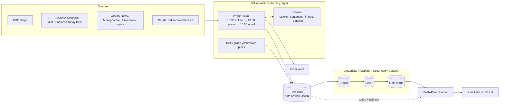

# NSE News Radar

[](https://github.com/Sakthi1030/databricks-stock-market-lakehouse/actions/workflows/ci.yml)
[](https://github.com/Sakthi1030/databricks-stock-market-lakehouse/actions/workflows/radar.yml)

Finds NSE stocks with fresh positive news, scores them at **2 PM IST** for a next-day **+1%** move, emails the
picks, and keeps an honest public track record of whether they worked.

**Live:** [databricks-stock-market-lakehouse.vercel.app](https://databricks-stock-market-lakehouse.vercel.app/) ·
API: [stock-lakehouse-api.onrender.com/docs](https://stock-lakehouse-api.onrender.com/docs)

Built for one retail strategy: read the news, buy in delivery before the close, sell the next day at +1%.
Signals come from public news; they are not investment advice.

## Architecture


```mermaid
flowchart LR
    subgraph Sources
      N[NSE filings]
      R[ET · Business Standard · Mint · Business Today RSS]
      G[Google News: Moneycontrol, Times Now, topics]
      D[Reddit: IndianStreetBets +2]
    end
    subgraph "GitHub Actions (trading days)"
      P[Python radar<br/>13:30 collect → 13:58 prices → 14:00 email]
      M[Gemini<br/>stocks · sentiment · impact · catalyst]
      O[15:45 grade yesterday's picks]
    end
    Sources --> P
    P <--> M
    P --> E[Email alert]
    P --> Z[(Raw zone<br/>data branch, JSON)]
    O --> Z
    Z --> B[(Bronze)] --> S[(Silver)] --> GD[(Gold marts)]
    subgraph "Databricks (PySpark + Delta, Unity Catalog)"
      B
      S
      GD
    end
    GD --> API[FastAPI on Render]
    Z -. today + fallback .-> API
    API --> W[React site on Vercel]
```

- **Raw zone:** each run writes `latest.json`, `runs/<date>.json` and append-only `candidates`, `news` and
  `outcomes` JSON Lines to the repo's `data` branch. Data commits never trigger a deploy.
- **Databricks job (16:00 IST):** `01_bronze` → `02_silver` → `03_gold` in `workspace.nse_radar`.
  Gold answers "does the signal work?": pick performance, a daily track record (picks vs the other
  candidates, rolling 20-day hit rate), and hit rates by catalyst, score band and news source.
- **API:** today's picks come straight from the raw zone, fresh the moment the email goes out. History and
  analytics come from Gold. If the free-tier warehouse is asleep, the same numbers are computed from the raw
  zone and the response says `"source": "raw"`, so the site never hangs on a cold warehouse.

## The score

```
score = 0.45·news + 0.25·reach + 0.15·momentum + 0.15·volume        (each 0-100)
```

| Part | What it measures |
|---|---|
| News | Σ sentiment × impact/3 × source trust (NSE 1.0, RSS 0.8, Google 0.7, Reddit 0.5), halving every 12 h; bonus when several outlets agree |
| Reach | Share of the last 120 sessions where the next-day high was ≥ +1% above the close |
| Momentum | Peaks when the stock is already up 0.5–3% by 2 PM; weak when falling or stretched |
| Volume | Today's volume so far vs the 20-day average, adjusted for time of day |

Guards: under ₹1 crore/day traded (hard to exit at +1%), under ₹10, or already up > 6% (chasing) are skipped.
All weights and thresholds live in [`config/radar.yaml`](config/radar.yaml).

Every scored stock is graded the next day: a **hit** means its high reached +1% above the 2 PM price. A +1%
intraday high is common, so the track record compares picks against the other candidates; that gap is the
real test of the score.

## Repo layout

| Path | What |
|---|---|
| `radar/` | The 2 PM pipeline: sources, Gemini classification (keyword fallback), prices, scoring, grading, email |
| `lakehouse/` | PySpark Bronze/Silver/Gold transforms (pure functions, tested locally) |
| `databricks/notebooks/` | The three job tasks, each one call into `lakehouse.pipeline` |
| `backend/` | FastAPI: Gold via the SQL Warehouse with a time budget, raw-zone fallback |
| `react/` | The site: React 19, Tailwind 4, ECharts, AG Grid, Framer Motion |
| `.github/workflows/radar.yml` | The schedule: 13:30 IST run, 15:45 IST grading |

## Running it

```bash
pip install -r radar/requirements.txt
python -m radar run --force --no-wait --data-dir data      # today's picks, no email
python -m radar outcomes --data-dir data                    # grade past picks

pip install -r backend/requirements.txt
uvicorn backend.main:app --reload                            # API on :8000

cd react && npm ci && npm run dev                            # site on :5173
```

GitHub secrets for the scheduled run: `GEMINI_API_KEY`, `GMAIL_USER`, `GMAIL_APP_PASSWORD` (optional `MAIL_TO`).
Render needs `DATABRICKS_HOST`, `DATABRICKS_HTTP_PATH`, `DATABRICKS_TOKEN` and `ALLOWED_ORIGINS`.

## Tests

`pytest tests/radar tests/backend` (pipeline + API), `pytest tests/lakehouse` (Spark + Delta, needs Java 17),
`cd react && npm test`. CI runs all three on every push.
